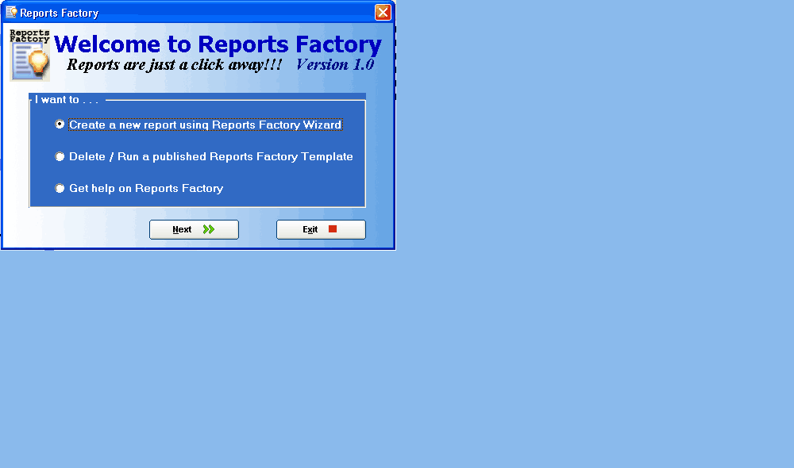



## Report Factory

### Description

Some Minor Changes now supports BLOB in oracle also

*** Newly added PostgreSQL database also *** Database connections have detailed description to create a database connection since users have requested this

*** Newly added MySQL database also ***

This is an industrial standard report generator, with posbilities of even publishing a report....download it and see yourself, anyuser can generate report with a few clicks or an admin user can publish a report which the end user can run and view the report. also attached is the help files for the same....

Dont forget to vote for me if you find the application worthy!!!
 
### More Info
 

             |
---                |---
**Submitted On**   |2006-12-09 15:32:48
**By**             |[Bijo Mathew](https://github.com/Planet-Source-Code/PSCIndex/blob/master/ByAuthor/bijo-mathew.md)
**Level**          |Advanced
**User Rating**    |4.9 (138 globes from 28 users)
**Compatibility**  |VB 6\.0
**Category**       |[Complete Applications](https://github.com/Planet-Source-Code/PSCIndex/blob/master/ByCategory/complete-applications__1-27.md)
**World**          |[Visual Basic](https://github.com/Planet-Source-Code/PSCIndex/blob/master/ByWorld/visual-basic.md)
**Archive File**   |[Report\_Fac2107563272008\.zip](https://github.com/Planet-Source-Code/bijo-mathew-report-factory__1-66632/archive/master.zip)

